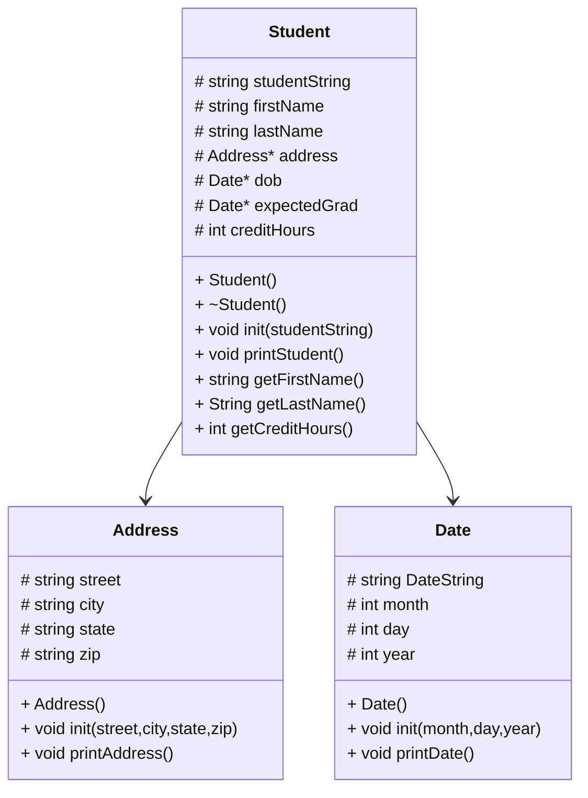

# CS121LabHeapOfStudents
BSU CS 121 course: lab 7

UML Diagram: 

```mermaid 
classDiagram

class Student{
# string studentString
# string firstName
# string lastName
# Address* address 
# Date* dob
# Date* expectedGrad
# int creditHours
+ Student()
+ ~Student()
+ void init(studentString)
+ void printStudent()
+ string getFirstName()
+ String getLastName()
+ int getCreditHours()
}


class Address{
# string street 
# string city 
# string state
# string zip
+ Address()
+ void init(street,city,state,zip)
+ void printAddress()
}

class Date{
# string DateString
# int month
# int day
# int year
+ Date()
+ void init(month,day,year)
+ void printDate()
}

Student --> Address
Student --> Date
```
